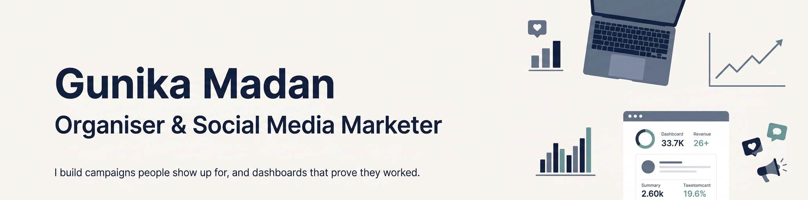

  

<h1 align="center">
  
</h1>

  

  
  
  

---

## 👩‍💻 About Me

I'm a final-year student at Jesus and Mary College, University of Delhi, studying **B.A. (Hons) Commerce with a minor in Economics**.

Commerce taught me how businesses make money and run. Economics taught me to look at evidence before making decisions. Alongside my degree, I've worked in social media, influencer marketing, content writing, and organising teams and events. In all of that work, one question kept coming up: *"Did this actually work?"*

That's why I'm building analytics skills alongside my marketing work. I want to back creative and organisational ideas with numbers, so that decisions about campaigns and audiences are based on data, not guesses.

## 📚 Currently Learning

- 📊 **Power BI:** turning campaign and audience data into dashboards
- 🤝 **HubSpot and Apollo:** managing outreach, contacts, and leads
- 🔍 **Reading the numbers:** working out which campaigns actually worked and why

## 🛠️ Tools & Tech

| Area | Tools |
|---|---|
| **Visualization** | Power BI |
| **Marketing & Outreach** | HubSpot, Apollo |
| **Foundations** | Commerce, Economics |

## 🚀 Projects & Case Studies

### 1. Influencer Marketing Negotiation
- **Business problem:** Brands need the right creators at the right price, without overspending on reach that doesn't convert.
- **Approach:** Shortlisted creators, negotiated rates and deliverables, and managed the collaborations.
- **Tools used:** Apollo (finding and contacting people), HubSpot (tracking conversations)

### 2. Instagram Broadcast Channel with PVR
- **Business problem:** Reach people directly and keep them engaged, instead of relying on posts the algorithm may not show.
- **Approach:** Planned and ran content for the channel to keep the audience engaged.
- **Tools used:** Instagram Broadcast Channels, Instagram Insights

### 3. Content Writing with Culture Gully
- **Business problem:** Publications need clear, engaging writing to attract and keep readers.
- **Approach:** Researched topics and wrote content on culture and trends.
- **Tools used:** Research, editorial writing, content planning

## 📊 GitHub Stats

  
  

## 🎯 Open To

Internships in **marketing** and **organising**, especially in social media, influencer marketing, partnerships, and event or team management.

## 🤝 Connect With Me

- 💼 **LinkedIn:** [gunika-madan-profile](https://www.linkedin.com/in/gunika-madan-profile/)
- 🌐 **Portfolio:** [View on Google Drive](https://drive.google.com/file/d/1pVyTM4ZLdgPKUcLFNETLZvtchIJgnW8p/view?usp=sharing)
- 📧 **Email:** [gunika.madan1106@gmail.com](mailto:gunika.madan1106@gmail.com)
